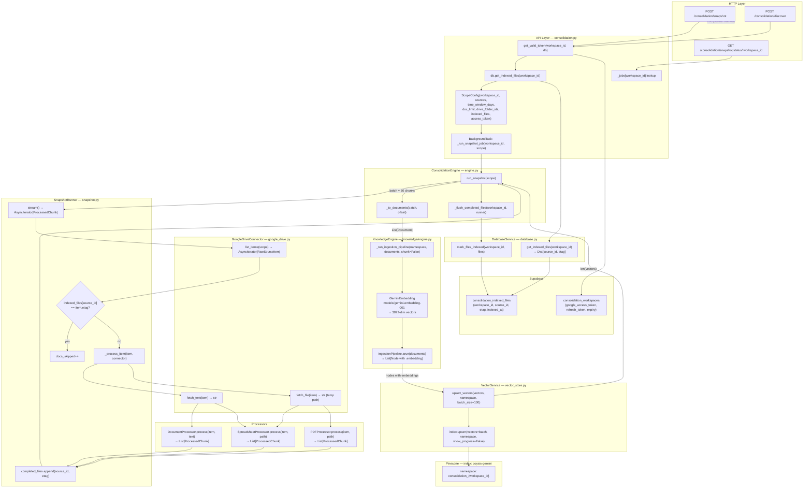

# Consolidation Pipeline — Engineering Reference

## Architecture Diagram



---

## Function Reference

### HTTP Endpoints — `app/api/consolidation.py`

---

#### `POST /consolidation/snapshot`

| | |
|---|---|
| **Receives** | `SnapshotRequest`: `workspace_id`, `sources`, `time_window_days` (default 90), `doc_limit` (default 500), `drive_folder_ids`, `cluster_instructions` |
| **Process** | 1. Calls `get_valid_token(workspace_id, db)` — refreshes OAuth if expired, raises 401 if missing. 2. Calls `db.get_indexed_files(workspace_id)` — loads `{source_id: etag}` map from Supabase. 3. Builds `ScopeConfig` with `indexed_files`. 4. Guards against concurrent runs via `_jobs[workspace_id].status == "running"` → 409. 5. Registers `_run_snapshot_job` as a FastAPI `BackgroundTask`. |
| **Returns** | `{"status": "started", "workspace_id": workspace_id}` — immediately, before any processing |

---

#### `GET /consolidation/snapshot/status/{workspace_id}`

| | |
|---|---|
| **Receives** | `workspace_id: str` (path param) |
| **Process** | Looks up `_jobs[workspace_id]` in the in-memory dict |
| **Returns** | `{"status": "not_started" \| "running" \| "done" \| "failed", "docs_processed": int, "docs_skipped": int, "vectors_indexed": int, "errors": List[str]}` |

---

#### `_run_snapshot_job(workspace_id, scope)` — background task

| | |
|---|---|
| **Receives** | `workspace_id: str`, `scope: ScopeConfig` |
| **Process** | Sets `_jobs[workspace_id] = {status: "running", ...}`. Awaits `engine.run_snapshot(scope)`. On success sets `status: "done"` + result fields. On exception sets `status: "failed"` + error string. |
| **Returns** | Nothing — mutates `_jobs` in place |

---

### ConsolidationEngine — `app/primitives/consolidation/engine.py`

---

#### `run_snapshot(scope: ScopeConfig) → Dict`

| | |
|---|---|
| **Receives** | `scope: ScopeConfig` (workspace_id, sources, time_window_days, doc_limit, indexed_files, google_access_token) |
| **Process** | Creates `SnapshotRunner(scope)`. Iterates `runner.stream()` accumulating chunks into a `batch: List[ProcessedChunk]`. When `len(batch) >= 50`: calls `_to_documents(batch, offset)`, then `knowledge._run_ingestion_pipeline(namespace, documents, chunk=False)`, then `_flush_completed_files`. Clears batch. Repeats for final partial batch. |
| **Returns** | `{"workspace_id", "docs_processed", "docs_skipped", "chunks_produced", "vectors_indexed", "errors"}` |

---

#### `_to_documents(batch, offset) → List[Document]`

| | |
|---|---|
| **Receives** | `batch: List[ProcessedChunk]`, `offset: int` (total chunks before this batch) |
| **Process** | Maps each chunk to a LlamaIndex `Document`. Sets `id_ = f"{source_id}_{offset+i}"` for stable Pinecone vector IDs. Includes `page`/`total_pages` from `extra_metadata` if present. |
| **Returns** | `List[Document]` with `text`, `id_`, `metadata = {source_id, source_type, title, url, [page, total_pages]}` |

---

#### `_flush_completed_files(workspace_id, runner) → None`

| | |
|---|---|
| **Receives** | `workspace_id: str`, `runner: SnapshotRunner` |
| **Process** | If `db` is set and `runner.completed_files` is non-empty: copies the list, calls `db.mark_files_indexed(workspace_id, files)`, clears `runner.completed_files`. |
| **Returns** | Nothing — side effect: Supabase row upserts |

---

### SnapshotRunner — `app/primitives/consolidation/snapshot.py`

---

#### `stream() → AsyncIterator[ProcessedChunk]`

| | |
|---|---|
| **Receives** | Nothing (uses `self.scope`) |
| **Process** | For each `RawSourceItem` from `GoogleDriveConnector.list_items(scope)`: checks `scope.indexed_files.get(source_id) == item.etag` — if match, increments `docs_skipped` and skips. Otherwise calls `_process_item(item, connector)`, yields each chunk, increments `docs_processed`, appends `{source_id, etag}` to `completed_files`. Exceptions go to `self.errors`. |
| **Yields** | `ProcessedChunk` — one at a time, all chunks of file N before file N+1 |

---

#### `discover() → Dict`

| | |
|---|---|
| **Receives** | Nothing (uses `self.scope`) |
| **Process** | Iterates `connector.list_items(scope)` without downloading content. Counts files by `content_type`, sums `size_bytes`, collects distinct MIME types. |
| **Returns** | `{"total_files", "total_size_mb", "breakdown": {document, spreadsheet, pdf}, "mime_types_found"}` |

---

### GoogleDriveConnector — `app/primitives/consolidation/connectors/google_drive.py`

---

#### `list_items(scope) → AsyncIterator[RawSourceItem]`

| | |
|---|---|
| **Receives** | `scope: ScopeConfig` |
| **Process** | Builds Drive API `q` query: `trashed=false AND modifiedTime > cutoff AND (mime IN ...) AND (parent IN ...)`. Paginates with `pageSize=100`, stops at `scope.doc_limit`. |
| **Yields** | `RawSourceItem(source_id, source_type="google_drive", title, url=webViewLink, etag=modifiedTime, last_modified, content_type, mime_type, size_bytes)` |

---

#### `fetch_text(item) → str`

| | |
|---|---|
| **Receives** | `RawSourceItem` |
| **Process** | `GET /drive/v3/files/{id}/export?mimeType=text/plain` (or `text/csv` for Sheets). 60s timeout. |
| **Returns** | Plain text string |

---

#### `fetch_file(item) → str`

| | |
|---|---|
| **Receives** | `RawSourceItem` |
| **Process** | Streams `GET /drive/v3/files/{id}?alt=media` to a `tempfile.NamedTemporaryFile`. 120s timeout. 8 KB chunks. |
| **Returns** | Absolute path to temp file (caller is responsible for cleanup) |

---

### Processors — `app/primitives/consolidation/processors/`

---

#### `DocumentProcessor.process(item, text) → List[ProcessedChunk]`

| | |
|---|---|
| **Receives** | `RawSourceItem`, `text: str` (plain text from Google Docs/Slides) |
| **Process** | Splits on `\n{2,}` (paragraph breaks). Accumulates paragraphs into a buffer until `len(buffer) + len(paragraph) > 1600 chars` (~400 tokens), then emits a chunk and starts a new buffer. |
| **Returns** | `List[ProcessedChunk]` — each with `text`, `source_id`, `source_type`, `title`, `url` |

---

#### `SpreadsheetProcessor.process(item, file_path) → List[ProcessedChunk]`

| | |
|---|---|
| **Receives** | `RawSourceItem`, `file_path: str` (CSV or XLSX temp path) |
| **Process** | Parses spreadsheet row by row. Each row becomes one chunk. |
| **Returns** | `List[ProcessedChunk]` — one chunk per row |

---

#### `PDFProcessor.process(item, file_path) → List[ProcessedChunk]`

| | |
|---|---|
| **Receives** | `RawSourceItem`, `file_path: str` (PDF temp path) |
| **Process** | Extracts text page by page. Stores `page` and `total_pages` in `extra_metadata`. |
| **Returns** | `List[ProcessedChunk]` — with `extra_metadata = {page, total_pages}` |

---

### KnowledgeEngine — `app/primitives/knowledge/engine.py`

---

#### `_run_ingestion_pipeline(notebook_id, documents, chunk=False) → int`

| | |
|---|---|
| **Receives** | `notebook_id: str` (Pinecone namespace), `documents: List[Document]`, `chunk: bool` |
| **Process** | Builds `GeminiEmbedding(model="models/gemini-embedding-001")`. If `chunk=True` prepends `SentenceSplitter(chunk_size=512, overlap=50)` to pipeline. Runs `IngestionPipeline.arun(documents)` — no `vector_store` attached (avoids llama_index Pinecone hang). Collects nodes with `.embedding`. Builds `[{id, values, metadata}]` dicts, strips `None` metadata values. Calls `asyncio.to_thread(vector_service.upsert_vectors, vectors, notebook_id)`. |
| **Returns** | `int` — number of vectors upserted |
| **Note** | Consolidation always calls with `chunk=False` — processors already chunk. `chunk=True` is for the legacy notebook file upload path. |

---

### VectorService — `app/primitives/knowledge/vector_store.py`

---

#### `upsert_vectors(vectors, namespace, batch_size=100) → None`

| | |
|---|---|
| **Receives** | `vectors: List[{id: str, values: List[float], metadata: dict}]`, `namespace: str`, `batch_size: int` |
| **Process** | Iterates vectors in `batch_size` slices. For each slice calls `index.upsert(vectors=batch, namespace=namespace, show_progress=False)`. Prints `[VECTOR] -> Batch N OK` on success. |
| **Returns** | Nothing — side effect: Pinecone upserts |
| **Index** | `poysis-gemini`, dimension 3072, cosine metric, AWS us-east-1 serverless |

---

### DatabaseService — `app/primitives/database.py`

---

#### `get_indexed_files(workspace_id) → Dict[str, str]`

| | |
|---|---|
| **Receives** | `workspace_id: str` |
| **Process** | `SELECT source_id, etag FROM consolidation_indexed_files WHERE workspace_id = ?` |
| **Returns** | `{source_id: etag}` — used to skip unchanged files in SnapshotRunner |

---

#### `mark_files_indexed(workspace_id, files) → None`

| | |
|---|---|
| **Receives** | `workspace_id: str`, `files: List[{source_id, etag}]` |
| **Process** | Bulk upserts to `consolidation_indexed_files` on conflict `(workspace_id, source_id)` — updates etag and `indexed_at` if already present |
| **Returns** | Nothing |

---

## Data Models

### `ScopeConfig`
```
workspace_id: str
sources: List["google_drive" | "gmail" | "recordings"]
time_window_days: int = 90          # 0 = all time
doc_limit: int = 500                # -1 = unlimited
drive_folder_ids: List[str] = []    # [] = all folders
google_access_token: Optional[str]
indexed_files: Dict[str, str] = {}  # source_id → modifiedTime (etag)
cluster_instructions: List[dict]
```

### `RawSourceItem`
```
source_id: str          # Google Drive file ID
source_type: str        # "google_drive"
title: str
url: str                # webViewLink (surfaced as citation)
etag: str               # modifiedTime ISO string
last_modified: datetime
content_type: str       # "document" | "spreadsheet" | "pdf"
mime_type: str          # raw Google MIME
size_bytes: int
```

### `ProcessedChunk`
```
text: str
source_id: str
source_type: str
title: str
url: str
extra_metadata: dict    # {page, total_pages} for PDFs
```

### Pinecone vector metadata (per vector)
```
source_id: str
source_type: str
title: str
url: str
page: int               # PDFs only
total_pages: int        # PDFs only
```

---

## Supabase Schema

### `consolidation_indexed_files`
```sql
workspace_id  TEXT     NOT NULL
source_id     TEXT     NOT NULL
etag          TEXT     NOT NULL   -- modifiedTime, changes when file is edited
indexed_at    TIMESTAMPTZ DEFAULT NOW()
PRIMARY KEY (workspace_id, source_id)
```

### `consolidation_workspaces`
```
workspace_id          TEXT PK
google_access_token   TEXT
google_refresh_token  TEXT
google_token_expiry   TEXT
```

---

## In-Memory Job State — `_jobs`

```python
_jobs: Dict[str, Dict] = {
    "workspace_id": {
        "status": "not_started" | "running" | "done" | "failed",
        "vectors_indexed": int,
        "docs_processed": int,
        "docs_skipped": int,
        "chunks_produced": int,
        "errors": List[str],
        # on failure:
        "error": str
    }
}
```

**Limitation**: resets on Railway redeploy. A job that was `"running"` becomes `"not_started"` after restart, unblocking new runs automatically.

---

## Backlog — Discussed, Not Built

### 1. Spreadsheet deduplication
**Problem**: SpreadsheetProcessor emits one chunk per row. Real-world sheets have hundreds of duplicate/empty rows, inflating vector count massively and wasting Gemini embedding quota.
**Fix**: In `SpreadsheetProcessor.process()`, hash each row's text content before yielding. Skip rows whose hash has already been seen in the current file. Clean at processor level (before embedding) to avoid paying the API cost on duplicates.

### 2. Parallel content-type ingestion
**Problem**: The stream is strictly sequential — a large spreadsheet blocks all subsequent docs and PDFs from being processed.
**Fix**: Partition `runner.stream()` by `content_type` into separate queues. Index `document` and `pdf` types immediately while `spreadsheet` types are cleaned up. Requires restructuring `ConsolidationEngine.run_snapshot` to manage parallel async generators.

### 3. Clustering algorithm
**Scope**: User wants to write this themselves. Operates on the completed consolidated namespace in Pinecone.
**Design intent**: Soft cluster assignments (a chunk can belong to multiple clusters), algorithm-decided cluster count (no hardcoded K), orphan cluster for chunks that don't fit any topic. Likely uses k-means or HDBSCAN on the 3072-dim embeddings.

### 4. Query endpoint
**Scope**: `POST /consolidation/query` — retrieves relevant chunks from `consolidation_{workspace_id}` namespace.
**Design intent**: Support metadata filters (`source_type`, date range), return top-K results with `text`, `title`, `url`, `score`. URL field already stored per vector so citations are available immediately.

### 5. Gmail connector
**Scope**: Equivalent of `GoogleDriveConnector` for Gmail. Uses Gmail API to list threads within `time_window_days`, fetch message bodies, strip HTML, process into chunks via `DocumentProcessor`.
**Plumbing already exists**: `ScopeConfig` already has `gmail_labels: List[str]` and `"gmail"` is a valid source type.

### 6. Persistent job status
**Problem**: `_jobs` dict is in-memory. A Railway restart during a long snapshot makes the status unreachable and blocks the 409 guard until the new instance gets a fresh request.
**Fix**: Persist job state to a `consolidation_jobs` table in Supabase. Write `status: "running"` on start, `status: "done/failed"` on completion. Query Supabase in `snapshot_status` endpoint instead of `_jobs`. Fall back to `_jobs` for sub-second freshness during active runs.

### 7. Observability / token usage tracking
**Scope**: Track Gemini embedding API token usage and Pinecone upsert counts at every pipeline step. Surface in the status endpoint and/or a separate analytics endpoint. Needed for cost attribution per workspace.

### 8. Audio pipeline
**Explicitly deferred.** Would process meeting recordings into transcripts (via Whisper or similar), then chunk transcripts and index into the same consolidated namespace. `ScopeConfig` already has `recording_channel_ids`.

### 9. Force re-index flag
**Scope**: `SnapshotRequest` flag `force: bool = False`. When `True`, bypasses `indexed_files` check and re-processes all files regardless of etag. Useful for debugging or when the embedding model changes.
